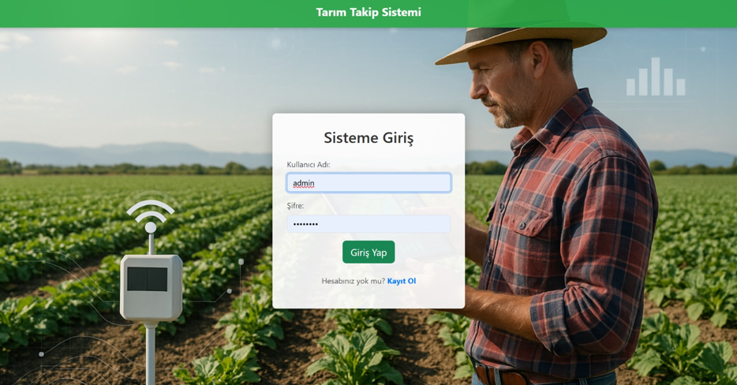
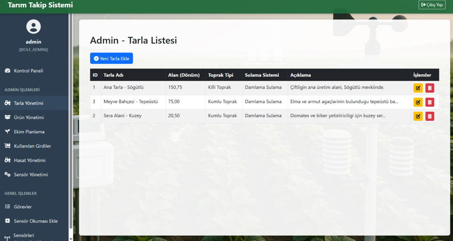
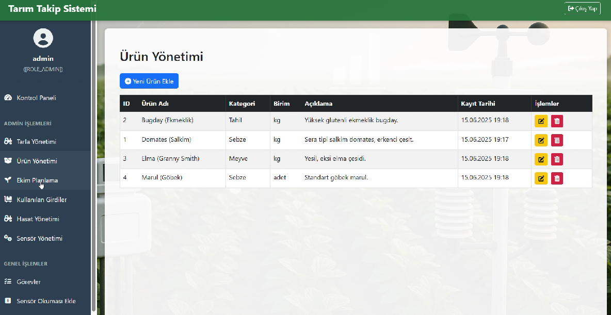
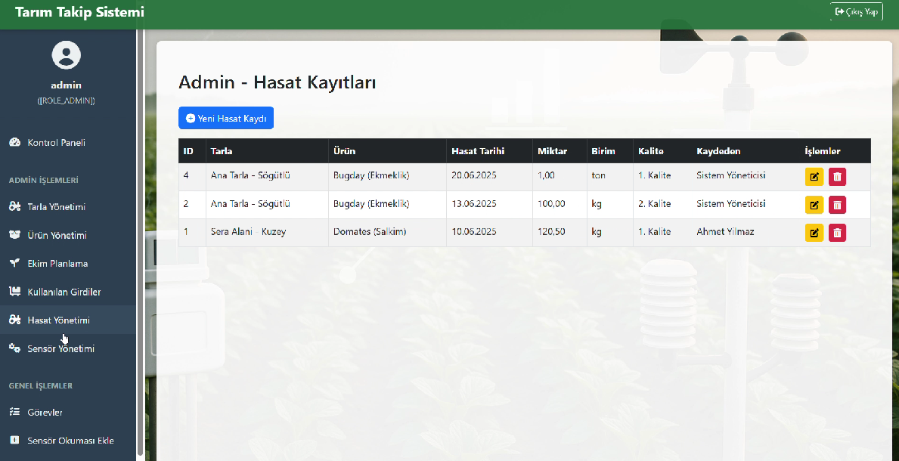
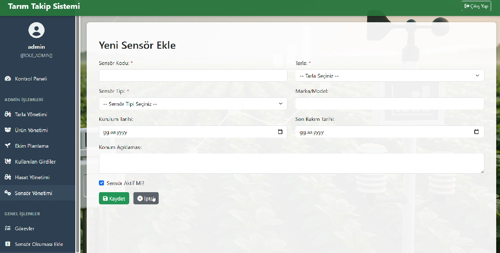
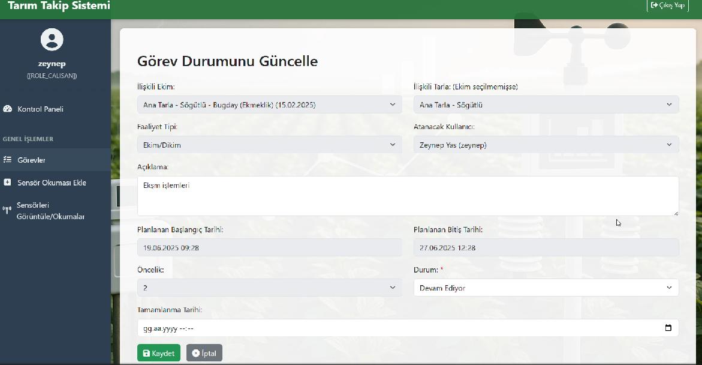
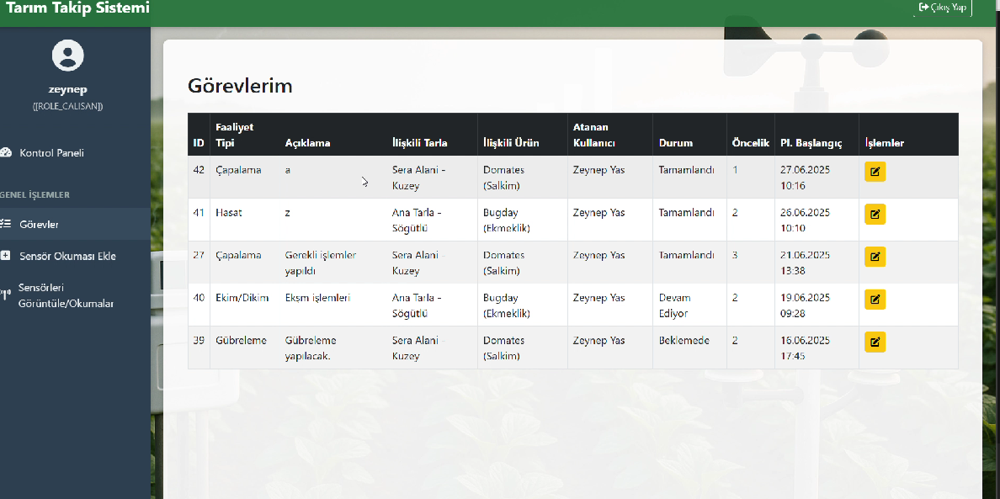
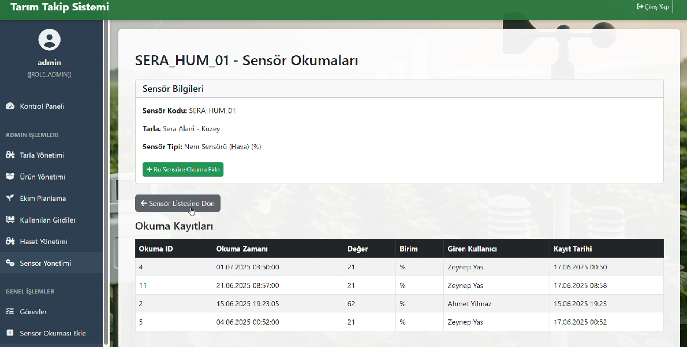

Tarım Takip Sistemi
Tarımsal üretim süreçlerini planlı, izlenebilir ve güvenli bir şekilde yönetmek amacıyla geliştirilmiş web tabanlı full‑stack bir bilgi sistemidir. Sistem; tarla yönetimi, ürün ve ekim planlama, görev atama ve takibi, hasat kayıtları ve sensör verilerinin izlenmesini merkezi bir yapı altında toplar.
## 📸 Uygulama Ekran Görüntüleri

### 🔐 Giriş

### 🛠️ Admin Paneli

### 👷 Çalışan Paneli

### 📡 Sensör

🎯 Projenin Amacı

Tarımsal faaliyetlerin manuel ve dağınık şekilde yürütülmesini önlemek

Ekim, görev ve hasat süreçlerini dijital ortamda kayıt altına almak

Rol bazlı erişim ile güvenli ve kontrollü bir sistem sunmak

Sezonluk veriler üzerinden izlenebilirlik ve verim analizi sağlamak

🧩 Sistem Özellikleri

Kullanıcı Yönetimi: Admin ve çalışan rolleri ile rol bazlı yetkilendirme (RBAC)

Tarla Yönetimi: Tarla alanı, toprak tipi ve sulama sistemi bilgileri

Ekim Planlama: Ürün–tarla–tarih bazlı ekim kayıtları

Görev Takibi: Sulama, gübreleme, ilaçlama gibi görevlerin atanması ve durum takibi

Hasat Yönetimi: Sezonluk hasat miktarlarının kaydı ve izlenmesi

Sensör Yönetimi: Tarla bazlı sensör tanımları ve manuel sensör okumaları

Yetkili Veri Erişimi: Çalışanların yalnızca kendi görevlerine erişebilmesi (RLS)

🛠️ Kullanılan Teknolojiler
Backend

Java 17

Spring Boot (Spring MVC, Spring Security, Spring Data JPA)

JDBC & Stored Procedure tabanlı veri erişimi

Frontend

HTML5

Thymeleaf

CSS / Bootstrap

Veritabanı

Microsoft SQL Server

18 normalize tablo (3NF)

49 Stored Procedure

10 View

10 Trigger (Audit Logging)

User‑Defined Functions (UDF)

Row‑Level Security (RLS)

Role‑Based Access Control (RBAC)

SQL Server Agent ile otomatik günlük yedekleme

🏗️ Sistem Mimarisi

Sistem, katmanlı mimari (Layered Architecture) yaklaşımıyla geliştirilmiştir:

Presentation Layer: HTML / Thymeleaf tabanlı kullanıcı arayüzü

Business Logic Layer: Spring Boot servisleri ve iş kuralları

Data Access Layer: Stored Procedure tabanlı SQL Server erişimi

Security Layer: Spring Security + RBAC + RLS
🔐 Güvenlik ve Veri Bütünlüğü

Form tabanlı kimlik doğrulama (Spring Security)

Rol bazlı yetkilendirme (Admin / Çalışan)

Satır düzeyinde güvenlik (RLS)

Trigger tabanlı denetim kayıtları (Audit Log)

Foreign Key ve CHECK constraint’ler ile veri bütünlüğü 
